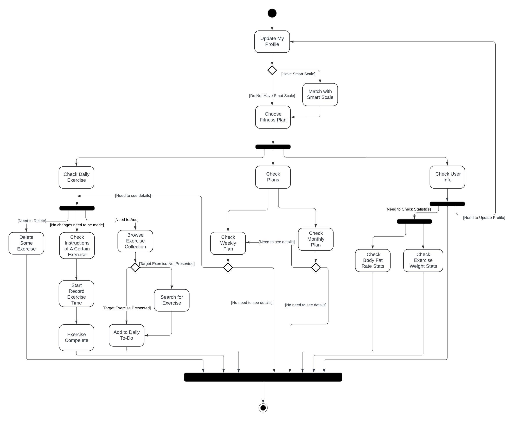

# Specification Phase Exercise

A little exercise to get started with the specification phase of the software development lifecycle. See the [instructions](instructions.md) for more detail.

## Team members

Barry Wang,
Alex Yu,
Keven Ni,
Nicole Wang

## Stakeholders

**Stakeholder Profile**:  
Frank, 22, is a fellow NYU student who has been working out for six months. While he is committed to his fitness routine, he feels that his approach lacks structure and progress has been slower than expected. He is looking for ways to train more effectively and track his progress in a structured way.

**Goals/Needs**:  
1. **Establish a Structured Workout Routine**: Mark wants a clear and systematic workout plan to follow, ensuring he is targeting the right muscle groups and progressing efficiently.
2. **Track Progress Over Time**: He is interested in seeing how his strength and endurance improve, particularly in terms of weight lifted and workout duration.
3. **Optimize Rest Periods and Workout Time**: Time management is important to him, and he wants to ensure he's not wasting time between sets or during his workouts.
4. **Stay Motivated**: Mark finds it hard to stay motivated without seeing tangible progress, so he needs a way to visualize his gains and stay on track.

**Problems/Frustrations**:  
1. **Lack of Organization**: His workouts feel unorganized, and he often goes to the gym without a clear plan, which affects his consistency and results.
2. **Difficulty Tracking Progress**: Mark has no easy way to log his performance during workouts, leading to uncertainty about whether he's improving or plateauing.
3. **Unsure About Proper Form**: He is concerned about whether he's performing exercises correctly, which might lead to injury or hinder his progress.
4. **Hard to Measure Gains**: Without a way to easily track and visualize his growth, Mark sometimes feels demotivated, unsure if his efforts are paying off.

**Stakeholder Profile**:  
Sarah, 21, is a NYC citizen who has been focusing on improving her fitness by losing weight while also building her athletic ability. Her goal isn't just weight loss; she wants to enhance her overall endurance and strength through a combination of aerobic exercises and strength training. Sarah is relatively new to structured workouts and seeks guidance on balancing both aspects of her fitness journey.

**Goals/Needs**:  
1. **Combine Weight Loss with Athletic Training**: Sarah wants a plan that not only helps her lose weight but also boosts her overall fitness, including strength and endurance.
2. **Track Both Strength and Cardio Metrics**: She needs a way to measure progress in both her aerobic capacity and strength, ensuring her workouts are balanced.
3. **Customize Workout Plans for Dual Goals**: Sarah wants a workout routine that targets fat loss and improves her sports performance, but she finds it challenging to balance the two effectively.

**Problems/Frustrations**:  
1. **Difficulty Balancing Cardio and Strength**: Sarah finds it hard to strike a balance between strength training and aerobic exercises, often feeling unsure which to prioritize during her gym sessions.
2. **Plateau in Weight Loss**: She feels like she's hitting a plateau in her weight loss journey and wants to make sure she's progressing in both fitness and weight management.
3. **Struggling to Measure Performance**: Sarah finds it challenging to quantify her improvements in athletic ability, especially with tracking endurance or sports-related metrics.
## Product Vision Statement

This app is a comprehensive fitness tracker that empowers users at all fitness levels to create personalized workout plans, log exercise details, track progress, and stay motivated with real-time data, visualized improvements, and smart device integration.

## User Requirements

1. As a fitness beginner user, I want to create a personalized fitness plan for me based on my fitness goals and body type so that I can easily get started and track my progress.
2. As a user, I want to record and save my workout duration and settings so that I don't have to re-enter this information the next time I exercise.
3. As an experienced fitness user, I want to be able to customize and modify the fitness plan so that it can be flexibly adjusted according to my actual situation.
4. As a user who want to manage weight, I want to be able to record my weight changes in the app so that I can check my weight progress at any time.
5. As a user who want to manage body fat, I want to be able to record and view my body fat percentage changes to track my progress at any time.
6. As a fitness beginner user, I want to be able to view detailed instructions and video guidance for each fitness move so that I can ensure that I perform each move correctly.
7. As a user, I want to be able to view my daily fitness goals in real time and check in to complete them so that I can stay motivated and stick to fitness.
8. As a smart scale user, I want to connect to my smart scale and automatically record weight and body fat percentage data so that I can reduce the trouble of manual input.
9. As a user, I want to be able to track my fitness improvements (such as strength, endurance, etc.) to motivate me to continue fitness.
10. As a user, I want to see how many consecutive days I have stayed consistent with my workouts so that I can stay motivated to continue exercising.

## Activity Diagrams

## Clickable Prototype

?node-id=0-1&t=PzTv0D0kD9CfKfva-1)
